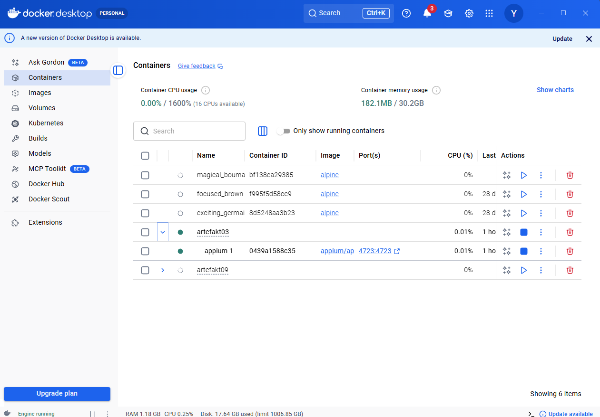
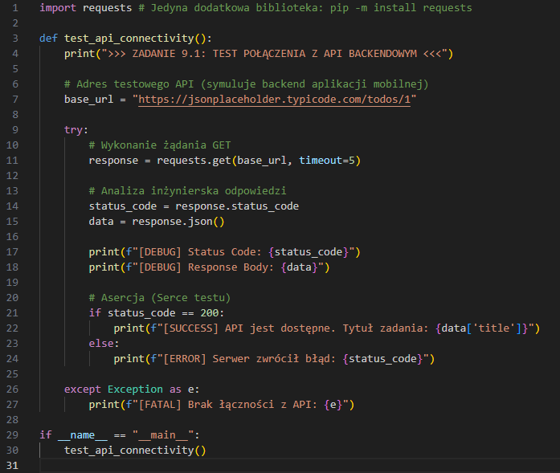
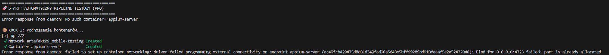
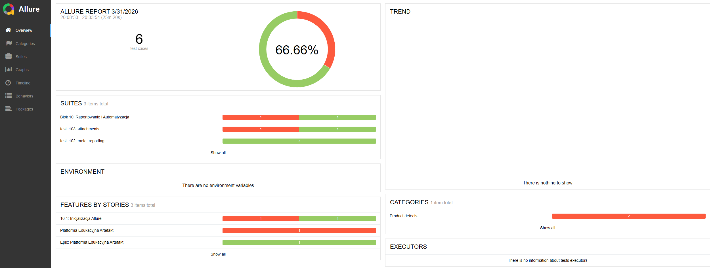

# 📱 Mobile Automation & Cloud-Ready Testing Suite

> 👨‍🏫 **Prowadzący:** mgr Mariusz Dworniczak  
> 🎓 **Student:** [Dariusz]  
> 🆔 **Numer Albumu:** [97123]  

---

## 🏗️ Architektura Projektu (Marketing & Tech Stack)

Ten projekt to kompletny ekosystem testowy oparty na podejściu **Cloud-Ready / Headless**. Zamiast polegać na zasobożernych i powolnych emulatorach lokalnych, infrastruktura skupia się na narzędziach CLI, dogłębnej analizie statycznej, konteneryzacji oraz pełnej automatyzacji procesów (Pipeline).

| Kategoria | Technologia | Zastosowanie w projekcie |
| :--- | :--- | :--- |
| **Język** | 🐍 Python 3.10+ | Skryptowanie, logika testów, API i automatyzacja procesów. |
| **Mobile Engine** | 🤖 Appium 2.x | Bezpośrednia automatyzacja interfejsu (UI) aplikacji mobilnych. |
| **Infrastruktura** | 🐳 Docker & Compose | Konteneryzacja serwerów i izolacja środowiska uruchomieniowego. |
| **Raportowanie** | 📊 Allure Framework | Generowanie interaktywnych, wizualnych raportów z wykonania testów. |
| **Analiza & CLI** | 🔍 MobSF & ADB | Statyczna analiza bezpieczeństwa plików APK oraz most debugowania. |

> **[🖼️ MIEJSCE NA GRAFIKĘ: Wklej tutaj schemat architektury lub logo głównych technologii]**

---

## 📅 PRZEBIEG LABORATORIUM (Kamienie Milowe)

### 🔹 BLOK 1: Tooling & Environment (Infrastruktura)
Przygotowanie solidnej bazy narzędziowej w modelu kontenerowym.
* **Co zrobiono:** Pobranie i ścisła konfiguracja obrazów `appium`, `android-sdk` oraz `mobsf`.
* **Wniosek:** [OPISZ SAM - dlaczego używamy obrazów Docker zamiast instalować wszystko lokalnie na hoście?]
> **[🖼️ ]**

### 🔹 BLOK 2: Debugowanie i Analiza Statyczna (MobSF)
Zrozumienie "wnętrza" i architektury aplikacji mobilnej przed przystąpieniem do testów dynamicznych.
* **Co zrobiono:** Wykorzystanie frameworka MobSF do głębokiego skanowania plików `.apk` pod kątem podatności (vulnerabilities) i struktury uprawnień.
* **Wniosek:** [OPISZ SAM - co daje testerowi analiza statyczna kodu APK przed napisaniem pierwszego testu?]
> **[🖼️ MIEJSCE NA GRAFIKĘ: Zrzut ekranu z dashboardu MobSF pokazujący wynik skanowania Twojej aplikacji]**

### 🔹 BLOK 3-4: Fundamenty Skryptowania (Python for QA)
Budowa modularnej logiki testowej w języku Python.
* **Co zrobiono:** [OPISZ SAM - o jakich strukturach danych (np. listy, słowniki) i funkcjach się uczyłeś?]
> **[🖼️ ]**

### 🔹 BLOK 5-7: Hybrydowe Testowanie API (Requests & Pytest)
Weryfikacja warstwy backendowej, z którą komunikuje się aplikacja mobilna.
* **Co zrobiono:** Testowanie endpointów REST (wykorzystano JSONPlaceholder), precyzyjna obsługa kodów HTTP oraz asercja struktur danych JSON.
* **Wniosek:** Testowanie API pozwala wyłapać krytyczne błędy logiki biznesowej o wiele szybciej, zanim uruchomimy powolne, ciężkie testy UI.
> **[🖼️ MIEJSCE NA GRAFIKĘ: Zrzut ekranu pokazujący wynik uruchomienia testów w terminalu (zielone kropki z Pytest)]**

### 🔹 BLOK 8: Appium UI Automation (Deep Dive)
Symulowanie realnych zachowań użytkownika i automatyzacja interakcji z interfejsem.
* **Co zrobiono:** [OPISZ SAM - jakich selektorów używałeś (np. ID, XPath, Accessibility ID)? Jakie konkretnie akcje symulowałeś na urządzeniu (klikanie, wpisywanie tekstu, scrollowanie)?]
> **[🖼️ MIEJSCE NA GRAFIKĘ: Zrzut ekranu z Appium Inspector pokazujący drzewo elementów interfejsu testowanej aplikacji]**

### 🔹 BLOK 9: Konteneryzacja Serwera (Docker Compose)
Całkowita izolacja silnika Appium od kaprysów systemu operacyjnego hosta.
* **Co zrobiono:** Skonstruowanie pliku `docker-compose.yml`, który w sposób deklaratywny zarządza serwerem Appium oraz niezbędnymi sterownikami mobilnymi.

---

## 🏆 MASTER PIPELINE (Capstone Project)
*Finałowa automatyzacja całego procesu testowego.*

Ostatni etap to połączenie wszystkich elementów w jeden płynnie działający mechanizm. Stworzono skrypt `pipeline.py`, który w zaledwie jednym cyklu realizuje pełen przepływ CI/CD (lokalnie):

1. **Setup:** Rezerwuje zasoby i automatycznie podnosi infrastrukturę w oparciu o Docker Compose.
2. **Execution:** Wykonuje asynchroniczne testy hybrydowe (API + Mobile UI).
3. **Reporting:** Zbiera wyniki i generuje profesjonalny raport Allure z metadanymi.
4. **Teardown:** Bezpiecznie "ubija" i czyści środowisko po zakończonej pracy (zapobieganie wyciekom zasobów).

> **[🖼️ ]**

---

## 📊 Raportowanie Wyników (Allure Dashboard)

Projekt wykorzystuje zaawansowane raportowanie **Allure Framework**, co przenosi analizę wyników na wyższy poziom. Zaimplementowano:
* Dokładne śledzenie poszczególnych akcji dzięki dekoratorom (`@allure.step`).
* Szybką analizę błędów wzbogaconą o załączniki (automatyczne zrzuty ekranu przy failach, logi JSON).
* Jasne dokumentowanie środowiska wykonawczego w sekcji *Environment*.

> **[🖼️ ]**

---

## 🚀 Instrukcja Uruchomienia (Quick Start)

Aby odtworzyć pełen proces testowy na dowolnym środowisku z zainstalowanym Pythonem i Dockerem, wystarczy wykonać poniższe kroki:

```bash
# 1. Przejdź do katalogu finałowego
cd Artefakt10

# 2. Uruchom główny proces testowy (Pipeline)
python pipeline.py

# 3. Wygeneruj i otwórz interaktywny raport
allure serve allure-results